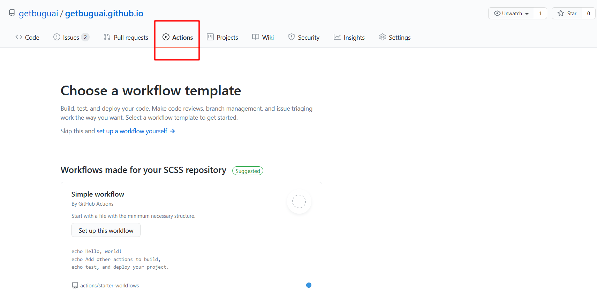
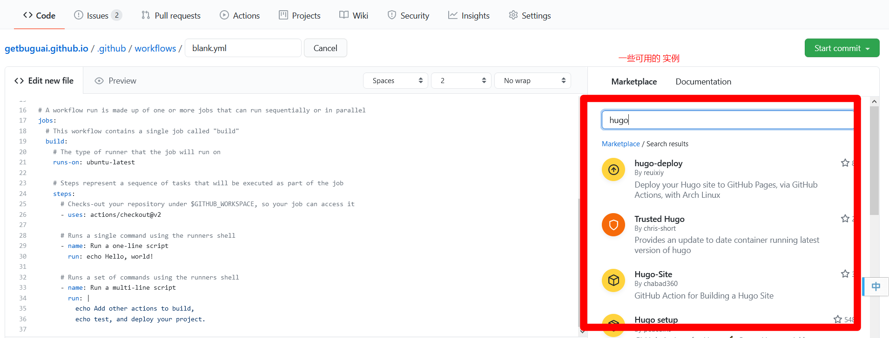
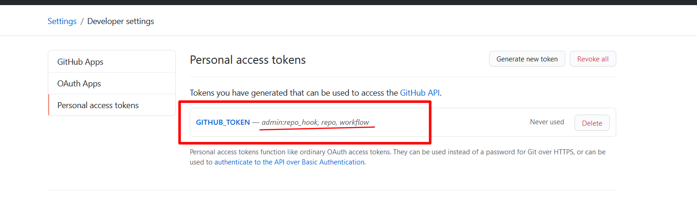

---
title: "GitHub Action 的使用"
date: 2021-02-11
draft: false
hidden: false
license: "原创授权：Bilibili : www.bilibili.com/read/cv9776049 "
math: false
slug: github-action
image: github_action.png
categories:
    - Git
tags: 
    - GitHub
    - CICD
description: "GitHub Action 的使用体会，体会 GitHub 自动构建 CICD 的过程"
--- 

> Bilibili 链接地址: https://www.bilibili.com/read/cv9776049

## 原由

该网站是搭建在 github 上的，也就是 gitpage 搭建。每次更新信息之后都需要手动 hugo -D 进行更新静态文件，
并更新到 github 的仓库。为了偷懒就想到了 cicd 的技术，也看到一些开源项目整合了一些 CICD 的功能。就简单的在网上 百度一下 ‘github cicd’。

## 步骤

不粗所料，前几个就是具体的操作方式，使用 git Action，看了一下，有点类似 gitlib 的 CICD，不过不需要自己的搭建 runner，

挺好不是吗？

紧接着就是查看项目中是否能 集成 Action 的功能，点击项目 https://github.com/getbuguai/getbuguai.github.io ，上放就是 Action 的分类，



点击进入，可以看到下方详细的环境分类，什么云之类的，我都没有，以及一些其他的分类。（英文一般我就忽略了）

直接点击最前面的 Simple workflow 中的 按钮。进入新的页面，下方是一个简单的案例，还有一堆注释，忽略，直接看到下方的 run: echo Hello, world!  

好家伙，果然逃不过 Hello, world! ，一切困难都是从简单的 Hello, world! 开始。

通过翻译看了一下大概的含义，也就和 gitlib 的 CICD  文件的步骤类似，相较后者容易上手很多。

紧接着注意到右方向的搜索，上来就是 hugo，前几条信息就是构建之类的脚本，找了几个类似的进去查看文档信息，可以看出并不是很复杂。



简单测试了一下 demo ，就对着 https://github.com/marketplace/actions/hugo-setup 这个脚本进行了魔改，去除自己不需要的部分。也就出现了下方的 Action 配置文件。

注意 secrets.GITHUB_TOKEN 参数为 个人信息设置中 developer setting 中的 权限 admin:repo_hook, repo, workflow 


## 自己 gitPage 的 Action 配置

```yaml
# 这是一个基本的工作流程，可帮助您开始使用操作

name: CI

# Controls when the action will run. 
on:
  # 在推或拉请求事件上触发工作流，但仅针对主分支
  push:
    branches: [ main ]
  pull_request:
    branches: [ main ]

  # 允许您从“操作”选项卡手动运行此工作流
  workflow_dispatch:

# 工作流运行由可以顺序或并行运行的一个或多个作业组成
jobs:
  # 此工作流程包含一个名为“ build”的作业
  build:
    # 作业将运行的运行程序类型
    runs-on: ubuntu-latest

    # 步骤表示将作为工作一部分执行的一系列任务
    steps:
      # 在$ GITHUB_WORKSPACE下签出您的存储库，以便您的工作可以访问它
      - uses: actions/checkout@v2
        with:
          submodules: true  # Fetch Hugo themes (true OR recursive)
          fetch-depth: 0    # Fetch all history for .GitInfo and .Lastmod

      # 使用运行程序外壳运行单个命令
      - name: 依赖环境
        uses: peaceiris/actions-hugo@v2
        with:
          hugo-version: '0.80.0'
          extended: true

      - name: 构建
        run: |
          hugo -D 

      - name: 部署
        run:  |
          git config --global user.email tgkoco@qq.com
          git config --global user.name getbuguai
          git add -A
          git commit -m 'git Action 部署' -a

      - name: 提交
        uses: ad-m/github-push-action@master
        with:
          github_token: ${{ secrets.GITHUB_TOKEN }}
```